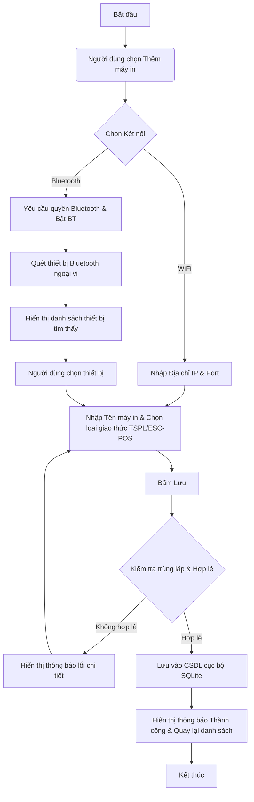
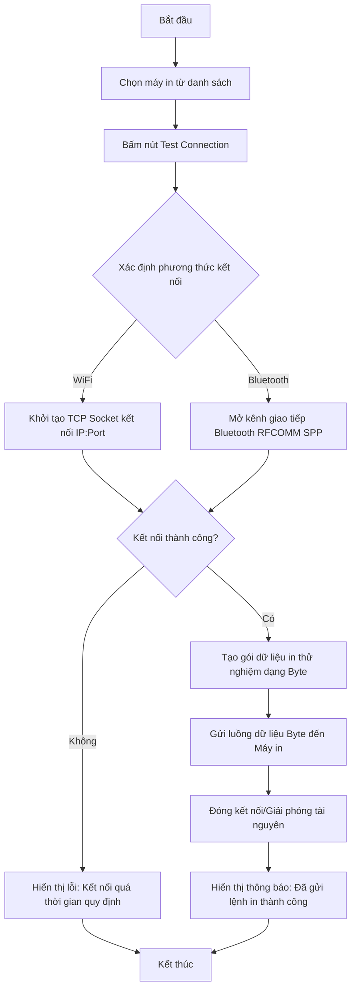
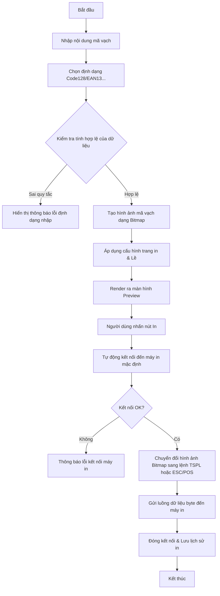
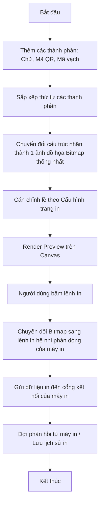
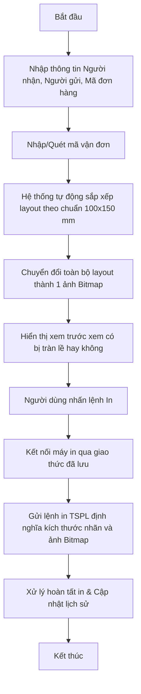
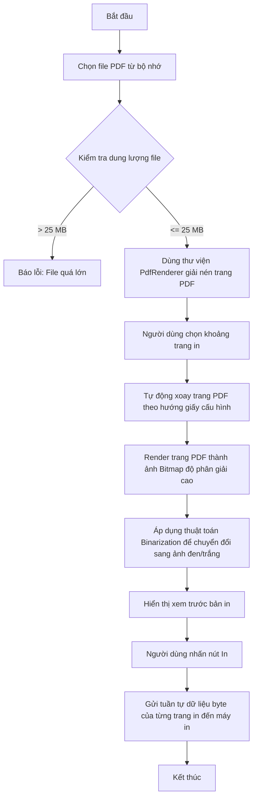
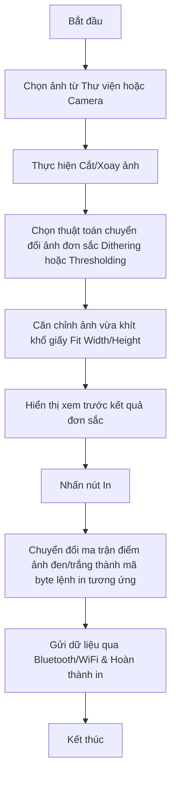
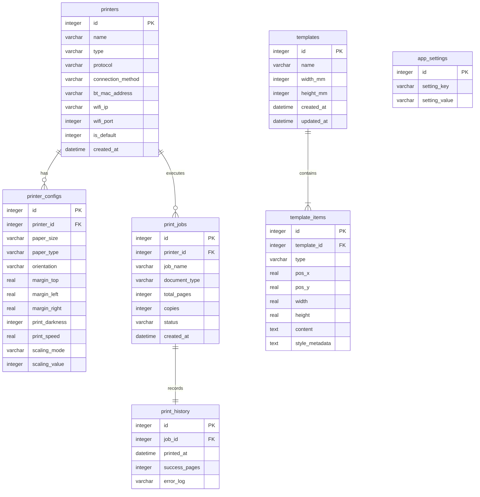

# TÀI LIỆU YÊU CẦU NGHIỆP VỤ (BUSINESS REQUIREMENTS DOCUMENT - BRD)
## DỰ ÁN: ỨNG DỤNG IN NHÃN CHUYÊN NGHIỆP - LABEL PRINT
* **Tên sản phẩm (Product Name):** Label Print
* **Package Name:** `com.chuot.labelPrint`
* **Nền tảng (Platform):** Android (Target SDK 34 - Android 14)
* **Tài liệu dành cho:** Product Team, UI/UX Design Team, Mobile Developers (Flutter/Native Android), QA/Testing Team.
* **Ngôn ngữ:** Tiếng Việt

---

## 1. TỔNG QUAN SẢN PHẨM (EXECUTIVE SUMMARY)

### 1.1 Giới thiệu chung
Label Print là ứng dụng di động chạy trên nền tảng Android, được thiết kế để giải quyết triệt để các vấn đề phức tạp và hạn chế về trải nghiệm người dùng của các ứng dụng in ấn nhãn hiện tại (như 4BarCode, Labelife, XPrinter...). Ứng dụng cung cấp khả năng kết nối không dây mạnh mẽ, cấu hình trực quan và khả năng tự động tối ưu hóa bản in để mang lại chất lượng in sắc nét nhất trên các dòng máy in nhiệt phổ biến.

### 1.2 Mục tiêu sản phẩm (Objectives)
*   **Chất lượng in vượt trội:** Tự động tối ưu hóa độ phân giải hình ảnh, văn bản và các đối tượng đồ họa (mã vạch, mã QR) để tránh tình trạng nhãn bị mờ hoặc vỡ nét.
*   **Cấu hình tối giản (Simpler Configuration):** Áp dụng hệ thống thiết lập thông minh dựa trên "Intelligent Defaults" (Cấu hình mặc định thông minh) tương ứng với từng loại khổ giấy và máy in.
*   **Tốc độ cài đặt tối đa:** Rút ngắn quy trình từ lúc mở ứng dụng đến lúc hoàn thành bản in đầu tiên xuống dưới 30 giây.
*   **Căn chỉnh lề chính xác (Accurate Paper Fitting):** Tự động phát hiện, tính toán tỷ lệ co giãn (scaling) và căn chỉnh lề (margins) dựa trên kích thước thật của giấy in, hạn chế tối đa việc lệch dòng hoặc mất thông tin.
*   **Kết nối không dây ổn định:** Nâng cao chất lượng kết nối Bluetooth (Classic & BLE) và WiFi (TCP/IP socket) thông qua việc tự động phát hiện thiết bị và duy trì trạng thái kết nối.

### 1.3 Mục tiêu kinh doanh (Business Goals)
*   Chiếm lĩnh thị trường ứng dụng bổ trợ in ấn cho các chủ shop kinh doanh vừa và nhỏ (SMBs) tại Việt Nam.
*   Tạo ra một hệ sinh thái in ấn độc lập, không phụ thuận vào SDK của một hãng sản xuất máy in cụ thể nào (như XPrinter, Gprinter, Brother).
*   Giảm thiểu tỷ lệ yêu cầu hỗ trợ kỹ thuật (support ticket) liên quan đến cài đặt máy in xuống dưới 5%.
*   Xây dựng mô hình doanh thu thông qua quảng cáo (Ad Monetization) cho phiên bản miễn phí và cung cấp tùy chọn nâng cấp Premium để gỡ bỏ quảng cáo.

---

## 2. PHÂN KHÚC NGƯỜI DÙNG MỤC TIÊU (TARGET USERS)

| Nhóm người dùng | Nhu cầu cốt lõi | Hành vi & Kịch bản sử dụng |
| :--- | :--- | :--- |
| **Người dùng cá nhân (Individual Users)** | In nhanh, đơn giản, không cần cấu hình phức tạp. | - In mã QR chia sẻ WiFi, tài khoản ngân hàng.<br>- In nhãn phân loại đồ dùng gia đình.<br>- In sticker trang trí. |
| **Chủ cửa hàng (Shop Owners)** | In nhãn sản phẩm, mã vạch quản lý hàng hóa, hóa đơn bán lẻ. | - In tem giá sản phẩm dán lên kệ.<br>- In tem mã vạch dán lên bao bì sản phẩm.<br>- In hóa đơn thanh toán trực tiếp từ điện thoại khi bán hàng. |
| **Nhân viên kho (Warehouse Users)** | In nhãn mã vạch với số lượng lớn, độ chính xác cao. | - In nhãn quản lý vị trí kệ kho (location label).<br>- In nhãn thùng hàng (carton label) chứa nhiều mã vạch.<br>- In nhãn kiểm kê định kỳ. |
| **Nhân viên Logistics / Giao vận (Logistics Users)** | In nhãn vận chuyển (shipping labels) từ các sàn TMĐT hoặc đơn vị vận chuyển. | - In nhãn vận chuyển tiêu chuẩn khổ A6 (100x150mm) từ các file PDF nhận được từ Shopee, Lazada, TikTok Shop, Giao Hàng Tiết Kiệm, v.v. |

---

## 3. LỘ TRÌNH PHÁT TRIỂN SẢN PHẨM (PHASE ROADMAP)

### Phase 1: Printing Platform (Nền tảng in ấn cốt lõi)
Tập trung vào phát triển hạ tầng kết nối, cấu hình in cơ bản và hỗ trợ in các định dạng tài liệu chuẩn hóa có sẵn.
*   **Định dạng nội dung hỗ trợ:** Mã vạch (Barcode), Mã QR (QR Code), Nhãn tự do (Label), Nhãn vận chuyển (Shipping Label), Phiếu giao hàng (Delivery Note), Hóa đơn bán hàng (Sales Receipt), Tài liệu PDF, Hình ảnh (JPG, PNG, WEBP).
*   **Kết nối máy in:** Bluetooth (Classic & BLE), WiFi (Local Network IP/Port).
*   **Giao thức máy in (Printer Protocols):**
    *   **ESC/POS:** Chuyên dụng cho in hóa đơn nhiệt (Receipt printer).
    *   **TSPL:** Chuyên dụng cho in nhãn nhiệt (Label printer).
*   **Khổ giấy hỗ trợ:** A5, A6, A7, A8 và các khổ giấy nhãn cuộn phổ biến (như 100x150mm, 75x100mm, 50x30mm).
*   **Loại giấy hỗ trợ (Paper Types):**
    *   *Label Paper* (Giấy decal cảm nhiệt có bóc dán).
    *   *Ticket Paper* (Giấy in hóa đơn thường).
    *   *Black Mark Paper* (Giấy có vạch đen đánh dấu điểm cắt).
    *   *Continuous Paper* (Giấy cuộn liên tục).
*   **Quảng cáo tích hợp:** Tích hợp quảng cáo Banner và quảng cáo Xen kẽ (Interstitial) để tối ưu hóa doanh thu từ người dùng miễn phí.

### Phase 2: Label Designer (Trình thiết kế nhãn tùy biến)
Phát triển công cụ thiết kế nhãn (WYSIWYG) trực quan ngay trên ứng dụng di động.
*   **Tính năng kéo thả (Drag & Drop Designer):** Canvas tương tác hỗ trợ kéo, thả, thay đổi kích thước, căn lề tự động các thành phần.
*   **Các thành phần thiết kế (Components):** Barcode, QR Code, Text, Image, Shape (Line, Rectangle, Circle).
*   **Hệ thống quản lý bản mẫu (Template System):** Cho phép lưu nhãn tự thiết kế thành template, sửa đổi, nhân bản, chia sẻ hoặc xóa template.

---

## 4. YÊU CẦU CHỨC NĂNG CHI TIẾT (FUNCTIONAL REQUIREMENTS)

### 4.1 Quản lý máy in (Printer Management)

#### Mô tả tính năng
Cho phép người dùng thực hiện các thao tác: Quét tìm máy in, Thêm mới máy in, Sửa thông tin, Xóa máy in, Thiết lập máy in mặc định và chạy thử lệnh in để kiểm tra kết nối (Test Connection).

#### User Story
> *Là một chủ cửa hàng, tôi muốn dễ dàng tìm kiếm và kết nối điện thoại của mình với máy in nhiệt qua Bluetooth hoặc WiFi để tôi có thể bắt đầu in nhãn sản phẩm mà không cần dây cáp phức tạp.*

#### Các trường thông tin (Data Fields)
*   **Tên máy in:** Chuỗi ký tự, tối đa 50 ký tự (Ví dụ: "Máy in mã vạch Kho A").
*   **Loại máy in:** Chọn một trong hai giá trị: `Nhãn (Label Printer - TSPL)` hoặc `Hóa đơn (Receipt Printer - ESC/POS)`.
*   **Giao thức (Protocol):** Tự động khóa theo loại máy in: `TSPL` cho nhãn, `ESC/POS` cho hóa đơn.
*   **Phương thức kết nối:** `Bluetooth` hoặc `WiFi`.
*   **Thông tin Bluetooth:**
    *   *Tên thiết bị (Device Name):* Lấy tự động từ hệ điều hành khi quét.
    *   *Địa chỉ MAC (MAC Address):* Định dạng chuẩn `XX:XX:XX:XX:XX:XX`.
*   **Thông tin WiFi:**
    *   *Địa chỉ IP (IP Address):* Địa chỉ IPv4 tĩnh của máy in (Ví dụ: `192.168.1.200`).
    *   *Cổng kết nối (Port):* Số nguyên từ 1 đến 65535. Giá trị mặc định là `9100`.

#### Quy tắc nghiệp vụ (Business Rules)
1.  Chỉ cho phép chọn một máy in làm mặc định tại một thời điểm. Khi chọn một máy in mới làm mặc định, máy in mặc định cũ sẽ tự động bị hủy trạng thái mặc định.
2.  Chức năng "Test Connection" sẽ gửi một lệnh in thử nghiệm (chứa logo ứng dụng, tên máy in, địa chỉ kết nối và câu thông báo "Kết nối thành công!").
3.  Khi quét Bluetooth, ứng dụng phải lọc và chỉ hiển thị các thiết bị thuộc nhóm thiết bị ngoại vi/máy in (Major Class: `IMAGING` hoặc `PERIPHERAL`).

#### Quy tắc kiểm tra dữ liệu (Validation Rules)
*   **Tên máy in:** Không được để trống.
*   **WiFi - Địa chỉ IP:** Phải tuân theo định dạng IPv4 chuẩn `^(?:[0-9]{1,3}\.){3}[0-9]{1,3}$`. Các octet phải nằm trong khoảng từ `0` đến `255`.
*   **WiFi - Cổng (Port):** Phải là số nguyên dương hợp lệ. Không được để trống.

#### Thông báo lỗi (Error Messages)
*   *Lỗi trống tên:* "Tên máy in không được để trống."
*   *Lỗi định dạng IP:* "Địa chỉ IP không đúng định dạng IPv4 (Ví dụ: 192.168.1.100)."
*   *Lỗi trùng MAC/IP:* "Máy in với địa chỉ kết nối này đã tồn tại trong danh sách."
*   *Lỗi kết nối thất bại:* "Không thể kết nối đến máy in. Vui lòng kiểm tra lại nguồn điện, khoảng cách Bluetooth hoặc địa chỉ IP mạng WiFi của bạn."

#### Thông báo thành công (Success Messages)
*   *Thêm máy in:* "Đã lưu thông tin máy in thành công."
*   *Kết nối thử:* "Kết nối thử nghiệm thành công! Lệnh in đã được gửi đi."

---

### 4.2 Cấu hình in (Printing Configuration)

#### Mô tả tính năng
Người dùng thiết lập các thông số vật lý của giấy in và thông số kỹ thuật của đầu in để đảm bảo bản in ra đúng kích thước, rõ nét và không bị lệch lề.

#### User Story
> *Là một nhân viên kho, tôi muốn cấu hình khổ giấy in là 100x150mm và điều chỉnh tốc độ in chậm lại một chút để nhãn in ra có độ sắc nét cao nhất và vừa vặn khít với con tem decal.*

#### Các thông số cấu hình chi tiết

##### A. Cài đặt trang (Page Settings)
*   **Khổ giấy (Paper Size):** Danh sách chọn bao gồm:
    *   `A5 (148 x 210 mm)`
    *   `A6 (105 x 148 mm)`
    *   `A7 (74 x 105 mm)`
    *   `A8 (52 x 74 mm)`
    *   `Tùy chỉnh (Custom Width x Custom Height)`
*   **Loại giấy (Paper Type):**
    *   `Giấy nhãn (Label/Decal Paper)` (Mặc định cho TSPL)
    *   `Giấy hóa đơn (Continuous Receipt Paper)` (Mặc định cho ESC/POS)
    *   `Giấy đánh dấu đen (Black Mark Paper)`
*   **Hướng giấy (Orientation):** `Dọc (Portrait)` hoặc `Ngang (Landscape)`.

##### B. Cài đặt lề (Margin Settings)
*   **Lề trên (Top Padding):** Tùy chỉnh từ `0 mm` đến `20 mm` (bước nhảy `0.5 mm`). Mặc định: `0 mm`.
*   **Lề trái (Left Padding):** Tùy chỉnh từ `0 mm` đến `20 mm` (bước nhảy `0.5 mm`). Mặc định: `0 mm`.
*   **Lề phải (Right Padding):** Tùy chỉnh từ `0 mm` đến `20 mm` (bước nhảy `0.5 mm`). Mặc định: `0 mm`.

##### C. Cài đặt độ đậm/Tốc độ in (Density Settings)
*   **Độ đậm (Darkness / Density):** Giá trị số từ `1` (nhạt nhất) đến `15` (đậm nhất). Mặc định: `8`.
*   **Tốc độ in (Print Speed):** Giá trị chọn: `2.0 ips` (inch/giây), `3.0 ips`, `4.0 ips`, `5.0 ips`, `6.0 ips`. Mặc định: `4.0 ips`.

##### D. Cài đặt tỷ lệ co giãn (Scaling Settings)
*   **Fit Width (Vừa khít chiều rộng):** Tự động co giãn nội dung theo chiều ngang của khổ giấy, chiều dọc co giãn theo tỷ lệ tương ứng.
*   **Fit Height (Vừa khít chiều cao):** Tự động co giãn nội dung theo chiều dọc của khổ giấy, chiều ngang co giãn theo tỷ lệ tương ứng.
*   **Scale % (Tùy chỉnh phần trăm):** Nhập giá trị phần trăm từ `50%` đến `200%` để zoom thủ công.

#### Quy tắc nghiệp vụ (Business Rules)
1.  Khi thay đổi khổ giấy, Preview Canvas phải lập tức cập nhật khung hiển thị theo tỷ lệ khung hình thực tế.
2.  Đối với `Continuous Paper` (Giấy cuộn liên tục), tùy chọn Chiều cao giấy (Height) sẽ được vô hiệu hóa hoặc tự động mở rộng theo độ dài của nội dung tài liệu.
3.  Nếu chọn `Label Paper`, ứng dụng sẽ gửi lệnh điều chỉnh cảm biến nhãn (GAP sensor) của máy in nhiệt trước khi in.

#### Quy tắc kiểm tra dữ liệu (Validation Rules)
*   Kích thước tùy chỉnh (Custom Width/Height) phải nằm trong khoảng từ `20 mm` đến `220 mm`.
*   Giá trị Scale phải là số nguyên nằm trong khoảng `[50, 200]`.

#### Thông báo lỗi (Error Messages)
*   *Lỗi kích thước:* "Kích thước giấy tùy chỉnh phải nằm trong khoảng từ 20mm đến 220mm."
*   *Lỗi tỉ lệ:* "Tỷ lệ in tùy chỉnh phải từ 50% đến 200%."

#### Thông báo thành công (Success Messages)
*   *Lưu cấu hình:* "Đã lưu cấu hình trang in."

---

### 4.3 Xem trước bản in (Print Preview)

#### Mô tả tính năng
Hiển thị một màn hình giả lập trực quan (Canvas) mô phỏng chính xác nhãn in ra thực tế dựa trên khổ giấy và lề đã thiết lập.

#### User Story
> *Là một nhân viên Logistics, tôi muốn xem trước nhãn vận chuyển vận đơn để chắc chắn rằng phần mã vạch và thông tin người nhận không bị cắt mất hoặc bị tràn ra ngoài biên con tem trước khi tôi bấm nút in.*

#### Quy tắc nghiệp vụ (Business Rules)
1.  **Hiển thị đường biên thực tế (Visual Boundary):** Canvas phải hiển thị một đường viền nét đứt (Dash line) màu xám đại diện cho lề không thể in được (Non-printable area) dựa trên thông số Padding đã cài đặt ở mục 4.2.
2.  **Tương tác thu phóng (Zoom & Pan):** Hỗ trợ thao tác cảm ứng đa điểm (Pinch-to-zoom) để phóng to/thu nhỏ lên tới `300%` và vuốt (Pan) để di chuyển khu vực hiển thị nhãn lớn.
3.  **Cập nhật thời gian thực:** Bất kỳ sự thay đổi nào về cấu hình độ đậm, hướng giấy hoặc lề đều phải cập nhật trực quan tức thì lên màn hình Preview trong vòng `< 100ms`.

---

### 4.4 In mã vạch (Print Barcode)

#### Mô tả tính năng
Tạo mã vạch chất lượng cao từ chuỗi ký tự nhập vào và gửi lệnh in.

#### Các loại mã vạch hỗ trợ (Barcode Types)
*   `Code 128` (Hỗ trợ ký tự chữ và số).
*   `EAN-13` (Mã số thương phẩm toàn cầu gồm 13 chữ số).
*   `EAN-8` (Mã số gồm 8 chữ số).
*   `UPC-A` (Mã sản phẩm chung của Mỹ gồm 12 chữ số).

#### Các trường thông tin (Data Fields)
*   **Nội dung mã vạch (Barcode Data):** Chuỗi nhập liệu.
*   **Loại mã vạch (Type):** Dropdown chọn (`Code128`, `EAN13`, `EAN8`, `UPCA`).
*   **Chiều cao mã vạch (Barcode Height):** Đơn vị dot/mm. Mặc định `80 dots` (~10mm).
*   **Hiển thị văn bản (Show Readable Text):** Checkbox ẩn/hiển thị chuỗi số bên dưới mã vạch.

#### Quy tắc kiểm tra dữ liệu (Validation Rules)
*   **EAN-13:** Phải chứa đúng 13 chữ số.
*   **EAN-8:** Phải chứa đúng 8 chữ số.
*   **UPC-A:** Phải chứa đúng 12 chữ số.
*   **Code-128:** Không được chứa các ký tự unicode tiếng Việt có dấu. Chỉ chấp nhận các ký tự chuẩn ASCII.

#### Thông báo lỗi (Error Messages)
*   *Lỗi định dạng EAN13:* "Mã vạch EAN-13 phải chứa đúng 13 chữ số."
*   *Lỗi định dạng Code128:* "Mã vạch Code-128 chỉ chấp nhận các ký tự chữ, số không dấu trong bảng mã ASCII."
*   *Lỗi kiểm tra checksum:* "Mã số không khớp với thuật toán kiểm tra lỗi (Checksum) chuẩn của hệ thống EAN."

---

### 4.5 In mã QR (Print QR Code)

#### Mô tả tính năng
Hỗ trợ tạo và in mã QR cho các mục đích thông dụng.

#### Các phân loại QR hỗ trợ
1.  **URL:** Đường dẫn trang web (Ví dụ: `https://shopee.vn/my_shop`).
2.  **Văn bản tự do (Plain Text):** Thông tin ghi chú, mã sản phẩm.
3.  **Danh bạ (vCard / Contact):** Chứa thông tin Tên, Điện thoại, Email, Địa chỉ.
4.  **Kết nối WiFi:** Tự động kết nối mạng bao gồm Tên WiFi (SSID), Mật khẩu (Password) và Loại bảo mật (WPA/WPA2/WEP).

#### Quy tắc nghiệp vụ (Business Rules)
*   Mức độ sửa lỗi (Error Correction Level) của mã QR được cấu hình mặc định là `Level H` (High - 30% phục hồi dữ liệu) để đảm bảo dù tem in ra có bị trầy xước nhẹ hoặc bị lem mực nhiệt thì máy quét vẫn đọc được.
*   Quy chuẩn chuỗi mã hóa cho WiFi QR: `WIFI:S:<SSID>;T:<WEP|WPA|nopass>;P:<PASSWORD>;H:<true|false>;;`.

---

### 4.6 In nhãn tự do (Print Label)

#### Mô tả tính năng
Tạo một nhãn in đơn giản kết hợp nhiều thành phần bao gồm: Chữ (Text), Mã vạch (Barcode), Mã QR (QR Code) và Hình ảnh (Image) trên cùng một con tem.

#### Quy tắc nghiệp vụ
*   Hệ thống bố cục theo mô hình khối dọc (Vertical Stack Layout).
*   Thứ tự hiển thị từ trên xuống: [Hình ảnh/Logo] -> [Nội dung chữ] -> [Mã vạch/Mã QR] -> [Dòng chữ chân trang].
*   Khoảng cách mặc định giữa các khối là `2 mm` (có thể điều chỉnh trong cài đặt lề nội bộ).

---

### 4.7 In nhãn vận chuyển (Print Shipping Label)

#### Mô tả tính năng
Cung cấp biểu mẫu chuẩn hóa để in nhãn dán lên gói hàng vận chuyển.

#### Các trường thông tin (Data Fields)
*   **Thông tin Người gửi (Sender):** Tên, Số điện thoại, Địa chỉ (Tỉnh/Thành, Quận/Huyện, Xã/Phường, Số nhà).
*   **Thông tin Người nhận (Receiver):** Tên, Số điện thoại, Địa chỉ chi tiết.
*   **Mã vận đơn (Tracking Number):** Chuỗi mã vạch giao vận (được render dưới dạng Barcode Code128 ở giữa nhãn).
*   **Mã đơn hàng (Order QR/Barcode):** Mã QR chứa thông tin chi tiết đơn hàng dùng cho đối soát.
*   **Nội dung hàng hóa & Ghi chú:** Danh sách sản phẩm, số lượng, số tiền cần thu hộ (COD), chỉ dẫn giao hàng (Ví dụ: "Cho xem hàng, không cho thử").

#### Quy tắc nghiệp vụ
*   Nhãn vận chuyển mặc định tối ưu theo tỷ lệ khung hình `100x150 mm` (Khổ giấy nhiệt A6 phổ biến nhất của các nhà vận chuyển).
*   Vùng chứa mã vận đơn (Barcode) phải chiếm tối thiểu `25%` chiều cao toàn bộ nhãn để đảm bảo thiết bị quét cầm tay của bưu tá có thể quét nhanh từ khoảng cách 30cm.

---

### 4.8 In phiếu giao hàng (Print Delivery Note)

#### Mô tả tính năng
In danh sách giao hàng kèm chữ ký xác nhận của khách hàng.

#### Các trường thông tin (Data Fields)
*   **Tiêu đề:** "PHIẾU GIAO HÀNG / DELIVERY NOTE" (In đậm, cỡ chữ lớn).
*   **Mã phiếu:** Số phiếu giao hàng tự động phát sinh hoặc nhập tay.
*   **Bảng sản phẩm (Item List):**
    *   Tên sản phẩm (Hỗ trợ xuống dòng tự động nếu quá dài).
    *   Số lượng (Quantity).
    *   Đơn vị tính (Unit).
*   **Khu vực xác nhận:** Gồm chữ ký Người giao hàng (Deliverer) và Người nhận hàng (Receiver) ở phần chân phiếu.

---

### 4.9 In hóa đơn bán hàng (Print Sales Receipt)

#### Mô tả tính năng
In hóa đơn thanh toán cho khách hàng, tối ưu hóa cho máy in bill nhiệt khổ giấy liên tục 80mm (K80) hoặc 57mm (K57) sử dụng giao thức ESC/POS.

#### Các trường thông tin (Data Fields)
*   **Thông tin cửa hàng:** Tên cửa hàng, Địa chỉ, Số điện thoại (Căn giữa).
*   **Thông tin hóa đơn:** Số hóa đơn (Invoice ID), Thời gian in, Tên nhân viên thu ngân.
*   **Bảng chi tiết thanh toán:**
    *   Cột Tên sản phẩm | Cột Số lượng | Cột Thành tiền.
*   **Tính toán tài chính:** Tổng tiền hàng, Chiết khấu/Giảm giá, Thuế VAT (nếu có), Tổng thanh toán cuối cùng.
*   **Lời cảm ơn:** "Cảm ơn Quý khách! Hẹn gặp lại." (Căn giữa).

#### Quy tắc nghiệp vụ
*   Đối với máy in hóa đơn (ESC/POS), cuối lệnh in phải tự động chèn mã lệnh cắt giấy tự động (Full/Partial Cut: `GS V 66 0` hoặc tương đương) nếu máy in hỗ trợ dao cắt tự động.
*   Nếu không hỗ trợ dao cắt, chèn thêm 5 dòng trống (`Feed Paper Lines`) để người dùng dễ xé giấy bằng tay.

---

### 4.10 In tài liệu PDF (Print PDF)

#### Mô tả tính năng
Đọc file PDF từ bộ nhớ điện thoại (qua File Picker), kết xuất (render) các trang PDF thành ảnh bitmap chất lượng cao và thực hiện in.

#### Quy tắc nghiệp vụ (Business Rules)
1.  **Chuyển đổi PDF sang Raster:** Do máy in nhiệt mini không thể tự thông dịch lệnh vẽ Vector của PDF, ứng dụng bắt buộc phải kết xuất từng trang PDF thành một ảnh bitmap ở độ phân giải tối thiểu `203 DPI` (hoặc `300 DPI` tùy cấu hình đầu in của máy in).
2.  **Xử lý đa trang:** Cho phép người dùng chọn in: "Tất cả các trang", "Trang hiện tại" hoặc nhập khoảng trang (Ví dụ: `1-3, 5`).
3.  **Tự động xoay trang (Auto-Rotation):** Nếu khổ giấy in đang đặt ở chiều dọc (Portrait) mà trang PDF lại nằm ngang (Landscape), ứng dụng phải tự động xoay trang PDF 90 độ để tận dụng tối đa vùng in của giấy.

#### Quy tắc kiểm tra dữ liệu
*   Kích thước file PDF tối đa được phép xử lý là `25 MB` để tránh tràn bộ nhớ RAM (Out Of Memory - OOM) của điện thoại Android khi thực hiện render ảnh bitmap.

#### Trạng thái triển khai (Phase 1)
- **Đã hoàn thành**: Tích hợp `file_picker` để duyệt file PDF từ bộ nhớ và `pdfx` để kết xuất trang PDF được chọn dưới dạng hình ảnh chất lượng cao.
- **Xem trước & Phân trang**: Hỗ trợ thanh điều hướng phân trang (Trang X / Y) cùng nút Trước/Sau. Cấu hình lề (`marginLeft`, `marginTop`) và xoay trang (0, 90, 180, 270 độ) hoạt động động trên khung Preview.
- **Quy trình in ấn**: Dùng thuật toán chuyển đổi sang bitmap đơn sắc 1-bit và gửi lệnh in qua usecase `PrintDocument`.

---

### 4.11 In hình ảnh (Print Image)

#### Mô tả tính năng
Chọn hình ảnh từ thư viện thiết bị (Gallery) hoặc chụp từ Camera, chỉnh sửa cơ bản và thực hiện in.

#### Các tính năng chỉnh sửa hình ảnh (Image Manipulation)
*   **Cắt ảnh (Crop):** Cắt theo các tỷ lệ cố định (`1:1`, `4:3`, `16:9`) hoặc tỷ lệ tự do.
*   **Xoay ảnh (Rotate):** Xoay 90, 180, 270 độ.
*   **Lọc đơn sắc (Dithering & Thresholding):** Đây là tính năng cốt lõi. Vì máy in nhiệt chỉ có 2 màu đen và trắng (không có thang xám - Grayscale), ứng dụng phải tích hợp thuật toán Floyd-Steinberg Dithering hoặc thuật toán tính ngưỡng tĩnh (Binarization Threshold) để chuyển đổi ảnh màu xám sang ảnh nghệ thuật dạng điểm đen/trắng cực kỳ sắc nét trước khi in.

#### Trạng thái triển khai (Phase 1)
- **Đã hoàn thành**: Sử dụng `image_picker` để chọn ảnh từ thư viện thiết bị.
- **Xoay ảnh**: Hỗ trợ xoay góc 90, 180, 270 độ bằng thuật toán xử lý mảng bytes RGBA trong `ImageUtils`.
- **Quy trình in ấn**: Tích hợp Floyd-Steinberg dithering chuyển đổi sang đơn sắc khi sinh lệnh in thông qua usecase `PrintDocument`.

---

### 4.12 Tích hợp Quảng cáo (Ad Integration)

#### Mô tả tính năng
Tích hợp quảng cáo hiển thị trên ứng dụng dành cho đối tượng người dùng sử dụng phiên bản miễn phí. Hỗ trợ hiển thị quảng cáo Banner cố định và quảng cáo Xen kẽ (Interstitial Ads) khi hoàn tất một hành động.

#### User Story
> *Là một người dùng miễn phí, tôi sẵn lòng xem một quảng cáo nhỏ ở dưới cùng màn hình chính hoặc một quảng cáo xen kẽ ngắn sau khi in xong để ứng dụng tiếp tục được cung cấp miễn phí.*

#### Quy tắc nghiệp vụ (Business Rules)
1.  **Quảng cáo Banner (Banner Ads):**
    *   Hiển thị một banner quảng cáo tĩnh (kích thước triêu chuẩn hoặc Adaptive Banner) ở phần dưới cùng của Màn hình Trang chủ (Home Screen), ngay phía trên Bottom Navigation Bar.
    *   Không được đè lên các nút bấm, menu lựa chọn hoặc che khuất bất kỳ phần tử tương tác quan trọng nào của người dùng.
    *   Nếu không load được quảng cáo (do mất mạng hoặc lỗi AdMob), vùng chứa banner quảng cáo phải tự động ẩn đi (height = 0) để nhường diện tích hiển thị cho giao diện ứng dụng.
2.  **Quảng cáo Xen kẽ (Interstitial Ads):**
    *   Hiển thị toàn màn hình sau khi người dùng hoàn thành một lệnh in thành công và nhấn quay lại màn hình chính, hoặc khi thực hiện lưu thành công một Bản mẫu thiết kế (Template).
    *   **Tần suất hiển thị (Frequency Capping):** Tối đa 1 lần quảng cáo xen kẽ trong mỗi 3 phút để tránh gây khó chịu và ức chế cho người dùng.
3.  **Tùy chọn tắt quảng cáo (Ad-Free Premium):**
    *   Cung cấp gói mua Premium nâng cấp (In-app Purchase hoặc Subscription). Khi tài khoản chuyển sang trạng thái Premium, toàn bộ quảng cáo Banner và Interstitial sẽ bị ẩn vĩnh viễn khỏi toàn bộ ứng dụng.

#### Quy tắc kiểm tra dữ liệu (Validation Rules)
*   ID quảng cáo (Ad Unit IDs) cho môi trường Production phải được cấu hình thông qua Firebase Remote Config thay vì hardcode trực tiếp dưới client, giúp dễ dàng chuyển đổi hoặc tắt quảng cáo từ xa khi có sự cố.

#### Thông báo lỗi (Error Messages)
*   Quảng cáo tải thất bại (ERR_AD_LOAD_FAIL) phải được xử lý ngầm (silently fail) mà không hiển thị bất kỳ pop-up lỗi nào làm ảnh hưởng đến trải nghiệm in ấn cốt lõi của người dùng.

---

## 5. SƠ ĐỒ QUY TRÌNH NGHIỆP VỤ (WORKFLOW DIAGRAMS)

### 5.1 Sơ đồ Thêm máy in (Add Printer)


### 5.2 Sơ đồ Kiểm tra kết nối (Test Connection)


### 5.3 Sơ đồ In mã vạch (Print Barcode)


### 5.4 Sơ đồ In nhãn tự do (Print Label)


### 5.5 Sơ đồ In nhãn vận chuyển (Print Shipping Label)


### 5.6 Sơ đồ In tài liệu PDF (Print PDF)


### 5.7 Sơ đồ In hình ảnh (Print Image)


---

## 6. DANH SÁCH MÀN HÌNH CHI TIẾT (SCREEN LIST)

### 6.1 Màn hình Trang chủ (Home Screen)
*   **Mục đích:** Là màn hình chính hiển thị ngay sau khi mở ứng dụng. Cung cấp lối tắt truy cập nhanh vào tất cả các tính năng in ấn chính và hiển thị trạng thái kết nối của máy in mặc định.
*   **Điều hướng:**
    *   Bấm vào các nút chức năng chính để chuyển hướng đến các màn hình in tương ứng (Mã vạch, Mã QR, Nhãn vận chuyển, v.v.).
    *   Bấm vào biểu tượng Máy in ở thanh công cụ góc trên bên phải để vào màn hình Quản lý máy in.
*   **Các thành phần UI chính:**
    *   *Header:* Tên ứng dụng "Label Print" và Biểu tượng máy in (có chỉ báo màu sắc trạng thái kết nối: Xanh - Đang kết nối, Đỏ - Mất kết nối, Xám - Chưa cấu hình máy in mặc định).
    *   *Grid Menu:* Các thẻ tính năng in: "In Mã Vạch", "In Mã QR", "In Nhãn Tự Do", "In Nhãn Vận Chuyển", "In Phiếu Giao Hàng", "In Hóa Đơn", "In File PDF", "In Hình Ảnh".
    *   *Ad Section:* Banner quảng cáo (Adaptive Banner) nằm cố định ở chân trang phía trên thanh điều hướng.
    *   *Footer:* Tab bar điều hướng nhanh giữa: Trang chủ, Lịch sử in, Bản mẫu (Templates).

### 6.2 Màn hình Quản lý máy in (Printer Management Screen)
*   **Mục đích:** Hiển thị danh sách các máy in đã lưu và thực hiện kết nối/tìm kiếm thiết bị mới.
*   **Điều hướng:** Bấm nút "+" ở góc phải màn hình để mở Popup/Màn hình Thêm máy in mới.
*   **Các thành phần UI chính:**
    *   Danh sách các máy in đã lưu dưới dạng danh sách (Card list). Mỗi dòng chứa: Tên máy in, biểu tượng kết nối (WiFi/Bluetooth), dấu tích xanh thể hiện máy in mặc định.
    *   Nút "Quét tìm thiết bị mới" (Scan) ở phía dưới cùng.
    *   Hành động trượt trái (Swipe left) trên dòng máy in để hiển thị nút "Sửa" và "Xóa".

### 6.3 Màn hình Cấu hình bản in & Lưu bản mẫu (Print Config & Save Template Screen)
*   **Mục đích:** Cấu hình các thông số kỹ thuật của bản in (khổ giấy, loại giấy, hướng giấy, lề, độ đậm, tốc độ, tỷ lệ co giãn) và cung cấp tùy chọn lưu thiết lập này thành bản mẫu (Template) để tái sử dụng.
*   **Điều hướng:** Mở ra từ biểu tượng Cài đặt trên màn hình Xem trước bản in hoặc màn hình in ấn cụ thể.
*   **Các thành phần UI chính:**
    *   Bộ chọn khổ giấy (A5, A6, A7, A8, Tùy chỉnh).
    *   Các trường nhập kích thước lề (Top, Left, Right Padding).
    *   Thanh trượt điều chỉnh Độ đậm in (Darkness: 1-15).
    *   Dropdown chọn Tốc độ in (Print Speed).
    *   Bộ chọn kiểu co giãn (Fit Width, Fit Height, Custom %).
    *   Trường nhập tên Bản mẫu (Template Name Input) để lưu thành bản mẫu.
    *   Nút "LƯU CẤU HÌNH" (Áp dụng cấu hình in hiện tại).
    *   Nút phụ "LƯU THÀNH BẢN MẪU" (Lưu cấu hình cùng thiết kế vào thư viện).

### 6.4 Màn hình Xem trước bản in (Print Preview Screen)
*   **Mục đích:** Xem trước thiết kế và chất lượng hình ảnh của tài liệu trước khi gửi lệnh in thực tế.
*   **Các thành phần UI chính:**
    *   Vùng Canvas hiển thị nội dung in (màu đen trên nền trắng).
    *   Nút phóng to, thu nhỏ nhanh (Quick zoom buttons).
    *   Thanh thông số hiển thị dưới cùng: "Khổ giấy: A6 | Lề: 0,0,0 | Độ đậm: 8 | Số bản sao: 1".
    *   Nút hành động lớn "IN NGAY" (Print Now) màu xanh lục nổi bật.

### 6.5 Màn hình In mã vạch (Barcode Printing Screen)
*   **Mục đích:** Nhập dữ liệu và cấu hình loại mã vạch để in.
*   **Các thành phần UI chính:**
    *   Trường nhập dữ liệu chuỗi (Text Input).
    *   Dropdown chọn Loại mã vạch (Code128, EAN13, EAN8, UPCA).
    *   Cấu hình hiển thị chữ số bên dưới (Switch ON/OFF).
    *   Nút "Tạo mã vạch & Xem trước".

### 6.6 Màn hình In mã QR (QR Printing Screen)
*   **Mục đích:** Tạo mã QR cho các liên kết, danh bạ hoặc cấu hình kết nối mạng WiFi nhanh.
*   **Các thành phần UI chính:**
    *   Tab Bar chọn loại nội dung: "Đường dẫn (URL)", "Văn bản", "Danh bạ", "Cấu hình WiFi".
    *   Các trường nhập tương ứng (Ví dụ WiFi: Tên mạng SSID, Mật khẩu, Kiểu mã hóa bảo mật).

### 6.7 Màn hình In nhãn tự do (Label Printing Screen)
*   **Mục đích:** Thiết kế nhãn cơ bản bằng cách thêm văn bản và hình ảnh theo trình tự.
*   **Các thành phần UI chính:**
    *   Nút thêm thành phần nhanh: "+ Thêm Chữ", "+ Thêm Hình ảnh", "+ Thêm Mã vạch", "+ Thêm Mã QR".
    *   Danh sách các thành phần đã thêm, hỗ trợ kéo kéo trượt để đổi thứ tự trên/dưới.

### 6.8 Màn hình In PDF (PDF Printing Screen)
*   **Mục đích:** Chọn, xem trước và in nội dung từ tệp tin PDF.
*   **Các thành phần UI chính:**
    *   Nút "Chọn tệp PDF từ thiết bị".
    *   Hiển thị thông tin tệp: Tên tệp, số trang, dung lượng.
    *   Vùng hiển thị Preview cuộn ngang (Horizontal scroll) để duyệt qua các trang PDF đã render sang bitmap đen/trắng.

### 6.9 Màn hình In hình ảnh (Image Printing Screen)
*   **Mục đích:** Chọn ảnh, cắt ghép, đổi màu sắc và in.
*   **Các thành phần UI chính:**
    *   Vùng hiển thị ảnh gốc và ảnh sau khi áp dụng bộ lọc đơn sắc (dạng Side-by-Side hoặc tab trước/sau).
    *   Thanh trượt điều chỉnh ngưỡng sáng/tối (Threshold Slider) để tinh chỉnh độ sắc nét khi chuyển đổi đen trắng.
    *   Bộ công cụ cắt xoay nhanh.

---

## 7. MÔ HÌNH PHÁC THẢO GIAO DIỆN (ASCII WIREFRAMES)

### 7.1 Màn hình Trang chủ (Home Screen)
```text
+-------------------------------------------------------------+
|  [=] LABEL PRINT                                    (o) [!] |  <-- Header: Menu, Tên ứng dụng, Status Máy in [!]
+-------------------------------------------------------------+
|  Trạng thái máy in: MÁY IN KHỎ A6 (192.168.1.200) - SẴN SÀNG |  <-- Widget trạng thái máy in mặc định
+-------------------------------------------------------------+
|                                                             |
|  +-----------------------+     +-----------------------+    |
|  |     [ Barcode ]       |     |        [ QR ]         |    |
|  |     In Mã Vạch        |     |       In Mã QR        |    |
|  +-----------------------+     +-----------------------+    |
|                                                             |
|  +-----------------------+     +-----------------------+    |
|  |      [ Label ]        |     |     [ Shipping ]      |    |
|  |     In Nhãn Tự Do     |     |     Nhãn Vận Chuyển   |    |
|  +-----------------------+     +-----------------------+    |
|                                                             |
|  +-----------------------+     +-----------------------+    |
|  |     [ Receipt ]       |     |       [ PDF ]         |    |
|  |      In Hóa Đơn       |     |       In File PDF     |    |
|  +-----------------------+     +-----------------------+    |
|                                                             |
|  +-----------------------+     +-----------------------+    |
|  |      [ Image ]        |     |      [ Delivery ]     |    |
|  |     In Hình Ảnh       |     |     Phiếu Giao Hàng   |    |
|  +-----------------------+     +-----------------------+    |
|                                                             |
+-------------------------------------------------------------+
|               [ QUẢNG CÁO BANNER / AD BANNER ]              |  <-- Vùng hiển thị quảng cáo Banner
+-------------------------------------------------------------+
|    [Trang chủ]            [Lịch sử in]          [Bản mẫu]    |  <-- Bottom Navigation Bar
+-------------------------------------------------------------+
```

### 7.2 Màn hình Quản lý máy in (Printer Management Screen)
```text
+-------------------------------------------------------------+
|  [<-] QUẢN LÝ MÁY IN                                     [+] |  <-- Nút [+] để thêm máy in mới
+-------------------------------------------------------------+
|  DANH SÁCH MÁY IN ĐÃ LƯU                                    |
|                                                             |
|  +-------------------------------------------------------+  |
|  | [v] Máy in kho A6 (Mặc định)                          |  |  <-- [v] là máy in mặc định
|  |     Loại: Nhãn (TSPL) | Kết nối: WiFi (192.168.1.200) |  |
|  |     [Test Connection] [Sửa] [Xóa]                     |  |
|  +-------------------------------------------------------+  |
|                                                             |
|  +-------------------------------------------------------+  |
|  | [ ] Máy in Bill K80                                   |  |
|  |     Loại: Hóa đơn (ESC/POS) | Kết nối: Bluetooth (MAC)|  |
|  |     [Test Connection] [Sửa] [Xóa]                     |  |
|  +-------------------------------------------------------+  |
|                                                             |
|  +-------------------------------------------------------+  |
|  |               [ QUÉT THIẾT BỊ MỚI (BLUETOOTH) ]       |  |  <-- Nút quét tìm thiết bị mới
|  +-------------------------------------------------------+  |
|                                                             |
+-------------------------------------------------------------+
```

### 7.3 Màn hình Cấu hình bản in & Lưu bản mẫu (Print Config & Save Template Screen)
```text
+-------------------------------------------------------------+
|  [<-] CẤU HÌNH BẢN IN & LƯU BẢN MẪU                         |
|  Lưu cấu hình cho: Máy in kho A6                            |
+-------------------------------------------------------------+
|                                                             |
|  Khổ Giấy In:                                               |
|  ( ) A5 (148x210mm)    (*) A6 (105x148mm)    ( ) Tùy chỉnh   |
|                                                             |
|  Loại Giấy:                                                 |
|  (*) Giấy Nhãn (Decal)  ( ) Giấy Hóa Đơn  ( ) Giấy Vạch Đen  |
|                                                             |
|  Hướng Giấy:                                                |
|  (*) Chiều dọc (Portrait)         ( ) Chiều ngang(Landscape)|
|                                                             |
|  Cài Đặt Lề (mm):                                           |
|  Lề Trên: [ 0.0 ]     Lề Trái: [ 0.0 ]     Lề Phải: [ 0.0 ] |
|                                                             |
|  Tốc Độ In:                                                 |
|  [ 4.0 ips      [v] ]                                       |
|                                                             |
|  Độ Đậm In (Darkness):                                      |
|  [|||||||||---------------] 8 / 15                          |
|                                                             |
|  Tỷ Lệ Co Giãn:                                             |
|  (*) Vừa khít ngang (Fit Width)    ( ) Tùy chỉnh: [ 100 ] % |
|                                                             |
|  Lưu thành bản mẫu (Tùy chọn):                              |
|  Tên bản mẫu: [ Nhập tên bản mẫu để lưu...                 ] |
|                                                             |
+-------------------------------------------------------------+
|        [ LƯU CẤU HÌNH ]         [ LƯU THÀNH BẢN MẪU ]       |
+-------------------------------------------------------------+
```

### 7.4 Màn hình Xem trước bản in (Print Preview Screen)
```text
+-------------------------------------------------------------+
|  [<-] XEM TRƯỚC BẢN IN (PRINT PREVIEW)                      |
+-------------------------------------------------------------+
|                                                             |
|   +----------------------------------------------------+    |
|   | . . . . . . . . . . . . . . . . . . . . . . . . .  |    |  <-- Đường nét đứt biểu thị lề vật lý của giấy
|   | .                                                . |    |
|   | .     +------------------------------------+     . |    |
|   | .     |               LOGO                 |     . |    |
|   | .     +------------------------------------+     . |    |
|   | .     Tên sản phẩm: Áo thun nam cỡ L       . |    |
|   | .     Mã sản phẩm: ATN-L-01                . |    |
|   | .     |||||||||||||||||||||||||||||||||||| . |    |  <-- Hình vẽ mã vạch mô phỏng
|   | .                 *ATN-L-01*               . |    |
|   | .                                                . |    |
|   | . . . . . . . . . . . . . . . . . . . . . . . . .  |    |
|   +----------------------------------------------------+    |
|                                                             |
|   [+] Phóng to          [-] Thu nhỏ          [o] Vừa màn hình|
+-------------------------------------------------------------+
|  Số bản sao: [ - ]  1  [ + ]                                |
|                                                             |
|                    [  NÚT IN NGAY  ]                        |
+-------------------------------------------------------------+
```

### 7.5 Màn hình In mã vạch (Barcode Printing Screen)
```text
+-------------------------------------------------------------+
|  [<-] IN MÃ VẠCH (BARCODE)                                  |
+-------------------------------------------------------------+
|                                                             |
|  Nhập dữ liệu mã vạch:                                      |
|  +-------------------------------------------------------+  |
|  | SP123456789                                           |  |
|  +-------------------------------------------------------+  |
|                                                             |
|  Định dạng mã vạch:                                         |
|  [ Code 128                  [v] ]                          |
|                                                             |
|  Chiều cao mã vạch (dots):                                  |
|  [ 80        ]                                              |
|                                                             |
|  [X] Hiển thị mã số dạng chữ bên dưới mã vạch                |
|                                                             |
+-------------------------------------------------------------+
|                                                             |
|  +-------------------------------------------------------+  |
|  |              XEM TRƯỚC HÌNH ẢNH MÃ VẠCH               |  |
|  |                                                       |  |
|  |              ||||||||||||||||||||||||||||             |  |
|  |                      SP123456789                      |  |
|  +-------------------------------------------------------+  |
|                                                             |
+-------------------------------------------------------------+
|                 [ TIẾP TỤC IN ]                             |
+-------------------------------------------------------------+
```

### 7.6 Màn hình In mã QR (QR Printing Screen)
```text
+-------------------------------------------------------------+
|  [<-] IN MÃ QR (QR CODE)                                    |
+-------------------------------------------------------------+
|  [ URL ]   ( Văn bản )   ( Danh bạ )   ( WiFi )             |  <-- Tabs chuyển đổi nội dung QR
+-------------------------------------------------------------+
|                                                             |
|  Địa chỉ liên kết URL:                                      |
|  +-------------------------------------------------------+  |
|  | https://shopee.vn/my_shop                             |  |
|  +-------------------------------------------------------+  |
|                                                             |
|  Mức độ sửa lỗi (Error Correction):                         |
|  ( ) Level L (7%)   ( ) Level M (15%)   (*) Level H (30%)   |
|                                                             |
+-------------------------------------------------------------+
|                                                             |
|  +-------------------------------------------------------+  |
|  |               XEM TRƯỚC HÌNH ẢNH MÃ QR                |  |
|  |                        +-----+                        |  |
|  |                        | [ ] |                        |  |
|  |                        +-----+                        |  |
|  +-------------------------------------------------------+  |
|                                                             |
+-------------------------------------------------------------+
|                 [ TIẾP TỤC IN ]                             |
+-------------------------------------------------------------+
```

### 7.7 Màn hình In nhãn tự do (Label Printing Screen)
```text
+-------------------------------------------------------------+
|  [<-] IN NHÃN TỰ DO (LABEL CREATOR)                         |
+-------------------------------------------------------------+
|  DANH SÁCH THÀNH PHẦN                                       |
|                                                             |
|  +-------------------------------------------------------+  |
|  | [=] 1. Hình ảnh: Logo_Shop.png                  [Xoa] |  |  <-- [=] là handle để kéo thả đổi thứ tự
|  +-------------------------------------------------------+  |
|  | [=] 2. Văn bản: "Cửa hàng thời trang cao cấp"   [Xoa] |  |
|  +-------------------------------------------------------+  |
|  | [=] 3. Mã vạch: SP-998877                       [Xoa] |  |
|  +-------------------------------------------------------+  |
|                                                             |
|  +-------------------------------------------------------+  |
|  |   [+ Chữ]   [+ Hình ảnh]   [+ Mã vạch]   [+ Mã QR]    |  |  <-- Nút thêm các thành phần vào nhãn
|  +-------------------------------------------------------+  |
|                                                             |
+-------------------------------------------------------------+
|                 [ TIẾP TỤC IN ]                             |
+-------------------------------------------------------------+
```

### 7.8 Màn hình In tài liệu PDF (PDF Printing Screen)
```text
+-------------------------------------------------------------+
|  [<-] IN TÀI LIỆU PDF                                       |
+-------------------------------------------------------------+
|                                                             |
|  +-------------------------------------------------------+  |
|  |                [ CHỌN FILE PDF TỪ MÁY ]               |  |
|  +-------------------------------------------------------+  |
|  Tên file: Don_hang_shopee_3884.pdf                         |
|  Dung lượng: 1.2 MB | Tổng số trang: 2 trang                |
|                                                             |
|  Khoảng trang cần in:                                       |
|  (*) Tất cả các trang       ( ) Trang tùy chỉnh: [ 1 ]      |
|                                                             |
|  Xem trước các trang kết xuất:                              |
|  +--------------+   +--------------+                        |
|  |              |   |              |                        |
|  |  Trang 1/2   |   |  Trang 2/2   |                        |  |  <-- Cuộn ngang xem ảnh chụp trang PDF dạng đen/trắng
|  |              |   |              |                        |
|  +--------------+   +--------------+                        |
|                                                             |
+-------------------------------------------------------------+
|                 [ TIẾP TỤC IN ]                             |
+-------------------------------------------------------------+
```

### 7.9 Màn hình In hình ảnh (Image Printing Screen)
```text
+-------------------------------------------------------------+
|  [<-] IN HÌNH ẢNH                                           |
+-------------------------------------------------------------+
|                                                             |
|  +-------------------------------------------------------+  |
|  |                [ CHỌN ẢNH TỪ THƯ VIỆN ]               |  |
|  |               [ CHỤP ẢNH TỪ MÁY ẢNH ]                 |  |
|  +-------------------------------------------------------+  |
|                                                             |
|  Công cụ xử lý:                                             |
|  [ Cắt ảnh ]      [ Xoay 90 độ ]       [ Đối xứng ngang ]   |
|                                                             |
|  Thuật toán chuyển đổi đơn sắc (Dithering):                 |
|  (*) Floyd-Steinberg   ( ) Ngưỡng tĩnh (Threshold)           |
|                                                             |
|  Điều chỉnh độ tương phản sáng tối:                         |
|  [-] [====================] [+] 128 / 255                   |
|                                                             |
+-------------------------------------------------------------+
|                 [ TIẾP TỤC IN ]                             |
+-------------------------------------------------------------+
```

---

## 8. MÔ HÌNH DỮ LIỆU CỤ CỤ BỘ (DATA MODEL)

### 8.1 Sơ đồ mối quan hệ thực thể (ERD)


### 8.2 Định nghĩa các bảng cơ sở dữ liệu (SQLite DDL)

#### Bảng `printers`
Lưu trữ danh sách máy in của người dùng.
```sql
CREATE TABLE printers (
    id INTEGER PRIMARY KEY AUTOINCREMENT,
    name TEXT NOT NULL,
    type TEXT CHECK(type IN ('LABEL', 'RECEIPT')) NOT NULL,
    protocol TEXT CHECK(protocol IN ('TSPL', 'ESC_POS')) NOT NULL,
    connection_method TEXT CHECK(connection_method IN ('BLUETOOTH', 'WIFI')) NOT NULL,
    bt_mac_address TEXT UNIQUE,
    wifi_ip TEXT,
    wifi_port INTEGER DEFAULT 9100,
    is_default INTEGER CHECK(is_default IN (0, 1)) DEFAULT 0,
    created_at DATETIME DEFAULT CURRENT_TIMESTAMP
);
```

#### Bảng `printer_configs`
Lưu trữ thông số cấu hình in tương ứng với từng máy in.
```sql
CREATE TABLE printer_configs (
    id INTEGER PRIMARY KEY AUTOINCREMENT,
    printer_id INTEGER NOT NULL,
    paper_size TEXT DEFAULT 'A6',
    paper_type TEXT DEFAULT 'LABEL',
    orientation TEXT CHECK(orientation IN ('PORTRAIT', 'LANDSCAPE')) DEFAULT 'PORTRAIT',
    margin_top REAL DEFAULT 0.0,
    margin_left REAL DEFAULT 0.0,
    margin_right REAL DEFAULT 0.0,
    print_darkness INTEGER DEFAULT 8,
    print_speed REAL DEFAULT 4.0,
    scaling_mode TEXT CHECK(scaling_mode IN ('FIT_WIDTH', 'FIT_HEIGHT', 'CUSTOM')) DEFAULT 'FIT_WIDTH',
    scaling_value INTEGER DEFAULT 100,
    FOREIGN KEY(printer_id) REFERENCES printers(id) ON DELETE CASCADE
);
```

#### Bảng `print_jobs`
Lưu trữ các lệnh in được tạo ra trong hệ thống.
```sql
CREATE TABLE print_jobs (
    id INTEGER PRIMARY KEY AUTOINCREMENT,
    printer_id INTEGER NOT NULL,
    job_name TEXT NOT NULL,
    document_type TEXT CHECK(document_type IN ('BARCODE', 'QR', 'LABEL', 'SHIPPING_LABEL', 'DELIVERY_NOTE', 'RECEIPT', 'PDF', 'IMAGE')) NOT NULL,
    total_pages INTEGER DEFAULT 1,
    copies INTEGER DEFAULT 1,
    status TEXT CHECK(status IN ('PENDING', 'PRINTING', 'SUCCESS', 'FAILED')) DEFAULT 'PENDING',
    created_at DATETIME DEFAULT CURRENT_TIMESTAMP,
    FOREIGN KEY(printer_id) REFERENCES printers(id)
);
```

#### Bảng `print_history`
Lưu trữ lịch sử thực tế các lần in để đối soát và tải lại file cũ nếu cần.
```sql
CREATE TABLE print_history (
    id INTEGER PRIMARY KEY AUTOINCREMENT,
    job_id INTEGER NOT NULL,
    printed_at DATETIME DEFAULT CURRENT_TIMESTAMP,
    success_pages INTEGER DEFAULT 0,
    error_log TEXT,
    FOREIGN KEY(job_id) REFERENCES print_jobs(id) ON DELETE CASCADE
);
```

#### Bảng `templates` (Sử dụng cho Phase 2)
```sql
CREATE TABLE templates (
    id INTEGER PRIMARY KEY AUTOINCREMENT,
    name TEXT NOT NULL,
    width_mm INTEGER NOT NULL,
    height_mm INTEGER NOT NULL,
    created_at DATETIME DEFAULT CURRENT_TIMESTAMP,
    updated_at DATETIME DEFAULT CURRENT_TIMESTAMP
);
```

#### Bảng `template_items` (Sử dụng cho Phase 2)
```sql
CREATE TABLE template_items (
    id INTEGER PRIMARY KEY AUTOINCREMENT,
    template_id INTEGER NOT NULL,
    type TEXT CHECK(type IN ('TEXT', 'BARCODE', 'QR', 'IMAGE', 'SHAPE')) NOT NULL,
    pos_x REAL NOT NULL,
    pos_y REAL NOT NULL,
    width REAL NOT NULL,
    height REAL NOT NULL,
    content TEXT,
    style_metadata TEXT,
    FOREIGN KEY(template_id) REFERENCES templates(id) ON DELETE CASCADE
);
```

#### Bảng `app_settings`
Lưu cấu hình hệ thống ứng dụng.
```sql
CREATE TABLE app_settings (
    id INTEGER PRIMARY KEY AUTOINCREMENT,
    setting_key TEXT UNIQUE NOT NULL,
    setting_value TEXT NOT NULL
);
```

---

## 9. XỬ LÝ LỖI (ERROR HANDLING)

Dưới đây là bảng định nghĩa các kịch bản lỗi hệ thống, thông báo thân thiện tới người dùng và giải pháp tự phục hồi.

| Mã lỗi (Error Code) | Tình huống lỗi (Scenario) | Thông báo hiển thị (Tiếng Việt) | Hướng xử lý khôi phục (Recovery Action) |
| :--- | :--- | :--- | :--- |
| **ERR_PRN_001** | Không tìm thấy máy in mặc định hoặc máy in đã lưu trong danh sách khi bắt đầu lệnh in. | "Không tìm thấy thông tin máy in mặc định. Vui lòng kết nối máy in trong danh sách." | Tự động chuyển hướng người dùng đến màn hình Quản lý máy in để chọn/thêm thiết bị. |
| **ERR_BT_001** | Điện thoại chưa bật Bluetooth khi gửi lệnh in qua Bluetooth. | "Bluetooth trên điện thoại đang tắt. Vui lòng bật Bluetooth để kết nối." | Gọi hộp thoại hệ thống Android (System Intent) yêu cầu người dùng bật Bluetooth ngay lập tức. |
| **ERR_BT_002** | Quyền vị trí / quét thiết bị Bluetooth bị người dùng từ chối (Android 12+ yêu cầu `BLUETOOTH_CONNECT` và `BLUETOOTH_SCAN`). | "Ứng dụng cần quyền Bluetooth để tìm máy in. Vui lòng cấp quyền trong Cài đặt." | Mở giao diện cài đặt ứng dụng (App Info Settings) của hệ điều hành để người dùng cấp lại quyền. |
| **ERR_CONN_TIMEOUT** | Quá thời gian chờ kết nối (Timeout 5 giây) đến IP:Port của WiFi hoặc kết nối kênh Bluetooth SPP. | "Không thể kết nối tới máy in. Vui lòng kiểm tra xem máy in có đang bật và cùng mạng WiFi không." | Dừng kết nối, thu hồi tiến trình, hiển thị nút "Thử lại" và hướng dẫn kiểm tra nhanh đèn tín hiệu máy in. |
| **ERR_IP_INVALID** | Nhập địa chỉ IP không đúng định dạng hoặc dải mạng không thuộc Local IP. | "Địa chỉ IP không hợp lệ. Vui lòng kiểm tra lại cấu hình WiFi của máy in." | Đánh dấu viền đỏ trường nhập liệu IP và chặn không cho nhấn nút Lưu. |
| **ERR_PAPER_UNSUPPORTED** | Chọn kích cỡ giấy in vượt quá phạm vi chiều rộng vật lý đầu in cho phép của máy. | "Khổ giấy đã chọn lớn hơn khả năng in của thiết bị (Tối đa: {max_width}mm)." | Đọc cấu hình máy in và tự động đưa ra cảnh báo co nhỏ tỷ lệ (Auto scaling) về kích thước tối đa mà máy in hỗ trợ. |
| **ERR_PDF_CORRUPT** | Tệp PDF tải lên bị mã hóa, lỗi định dạng hoặc hỏng dữ liệu không thể render ảnh. | "Tệp tài liệu PDF bị lỗi hoặc đã bị bảo vệ bằng mật khẩu. Không thể mở để in." | Dừng luồng xử lý, quay lại màn hình chọn tệp và đề xuất người dùng kiểm tra file trên thiết bị khác. |
| **ERR_RAM_OOM** | Máy in các tệp ảnh hoặc PDF độ phân giải quá cao dẫn đến hết bộ nhớ tạm thời RAM. | "Thiết bị hết bộ nhớ tạm thời. Đang tự động hạ độ phân giải in để hoàn tất lệnh." | Giải phóng RAM bằng Garbage Collection, giảm độ phân giải render (xuống 150 DPI) và thực hiện in lại. |
| **ERR_PRN_BUSY** | Máy in đang thực hiện lệnh in khác hoặc bị kẹt giấy, hết giấy (Nhận phản hồi mã lỗi từ dòng trạng thái). | "Máy in đang bận hoặc gặp lỗi (Hết giấy/Kẹt giấy). Vui lòng kiểm tra thiết bị phần cứng." | Đưa máy in về trạng thái chờ, hiển thị cảnh báo dạng banner nổi và kiểm tra lại trạng thái sau mỗi 3 giây. |

---

## 10. THÔNG BÁO THÀNH CÔNG (SUCCESS MESSAGES)

*   **Kết nối máy in thành công:** "Kết nối với máy in thành công! Thiết bị đã sẵn sàng để in."
*   **Thêm máy in thành công:** "Đã thêm máy in '{printer_name}' vào danh sách thiết bị của bạn."
*   **Lưu cấu hình thành công:** "Cấu hình in ấn đã được áp dụng thành công."
*   **Gửi lệnh in thành công:** "Đã gửi lệnh in thành công. Đang tiến hành in tài liệu..."
*   **Lưu Template thành công:** "Mẫu thiết kế nhãn của bạn đã được lưu thành công vào thư viện."

---

## 11. YÊU CẦU PHI CHỨC NĂNG (NON-FUNCTIONAL REQUIREMENTS)

### 11.1 Hiệu năng (Performance)
*   **Thời gian phản hồi giao diện:** Thời gian mở các màn hình chức năng và thực hiện thao tác chuyển trang phải dưới `2.0 giây` trên các thiết bị Android tầm trung (RAM 4GB).
*   **Thời gian xem trước (Preview Render):** Thời gian kết xuất từ dữ liệu nhập (Barcode, QR, Ảnh, PDF) sang ảnh xem trước trên màn hình phải dưới `3.0 giây`.
*   **Độ trễ truyền dữ liệu:** Thời gian từ lúc bấm nút "In Ngay" đến lúc máy in nhận được tín hiệu bắt đầu chạy đầu in nhiệt không quá `1.5 giây` đối với kết nối WiFi và không quá `3.0 giây` đối với kết nối Bluetooth.

### 11.2 Độ tin cậy & Khả năng chịu lỗi (Reliability)
*   **Hoạt động Ngoại tuyến (Offline Mode):** Ứng dụng phải hoạt động hoàn toàn offline không cần kết nối Internet (trừ trường hợp lấy file PDF/Hình ảnh từ lưu trữ đám mây). Các chức năng sinh mã vạch, mã QR và sinh lệnh máy in đều thực hiện trực tiếp trên thiết bị (On-device processing).
*   **Tự khôi phục sau sự cố (Crash/Restart recovery):** Khi ứng dụng bị tắt đột ngột do hệ thống Android thu hồi tài nguyên (OOM), khi mở lại ứng dụng phải tự động khôi phục lại cấu hình trang in đang thiết lập dở dang và trạng thái kết nối máy in mặc định.

### 11.3 Bảo mật dữ liệu (Security)
*   Dữ liệu lịch sử in ấn và cấu hình máy in được lưu trữ trong SQLite nội bộ của ứng dụng, không truyền tải lên bất kỳ máy chủ bên ngoài nào để bảo mật thông tin đơn hàng và thông tin khách hàng.
*   Ứng dụng chỉ yêu cầu các quyền truy cập tối thiểu cần thiết để vận hành: Quyền Bluetooth (để kết nối in), Quyền Vị trí (chỉ trên Android cũ để quét Bluetooth), Quyền Đọc bộ nhớ (để chọn file PDF/Ảnh).

---

## 12. KHUYẾN NGHỊ THIẾT KẾ KỸ THUẬT (TECHNICAL RECOMMENDATIONS)

### 12.1 Kiến trúc ứng dụng (Application Architecture)
Khuyến nghị sử dụng framework **Flutter** để có thể dễ dàng mở rộng sang iOS trong tương lai, áp dụng mô hình kiến trúc **Clean Architecture** kết hợp quản lý trạng thái **BLoC (Business Logic Component)**.

```text
+-------------------------------------------------------------+
|                     PRESENTATION LAYER                      |
|            (UI Screens, Widgets, Blocs/Providers)           |
+------------------------------+------------------------------+
                               |
                               v
+-------------------------------------------------------------+
|                        DOMAIN LAYER                         |
|         (Entities, Use Cases, Repository Interfaces)        |
+------------------------------+------------------------------+
                               |
                               v
+-------------------------------------------------------------+
|                         DATA LAYER                          |
|         (Repositories, Local Data Sources - SQLite)         |
+-------------------------------------------------------------+
```

### 12.2 Cơ sở dữ liệu nội bộ (Local Database)
Sử dụng thư viện **drift** (dựa trên SQLite) hoặc **sqflite** trong Flutter để đạt hiệu năng ghi chép dữ liệu lịch sử cao và đảm bảo tính toàn vẹn quan hệ (Foreign Key Constraints) giữa các bảng.

### 12.3 Chiến lược SDK Máy in (Printer Communication Strategy)
Để đảm bảo ứng dụng không bị giới hạn bởi SDK độc quyền của từng hãng sản xuất máy in, kiến trúc phần in ấn sẽ chia làm hai phần tách biệt: **Hệ thống tạo lệnh (Command Generator)** và **Hệ thống truyền thông (Transport Connection)**.

```text
+------------------+       +-------------------+       +-----------------------+
|  Nguồn tài liệu  | ----> |  Chuyển sang ảnh  | ----> |  Command Generator    |
| (PDF, Image, QR) |       |  Bitmap đen/trắng |       | (Chuyển sang TSPL/POS) |
+------------------+       +-------------------+       +-----------------------+
                                                                   |
                                                                   v
+------------------+       +-------------------+       +-----------------------+
|   Máy in vật lý  | <---- | Kênh truyền thông | <---- | Lệnh in dạng Byte     |
| (Nhiệt/Hóa đơn)  |       | (Socket/Bluetooth)|       | (Raw Byte Stream)     |
+------------------+       +-------------------+       +-----------------------+
```

#### A. Chiến lược in ESC/POS (Cho hóa đơn)
*   Sử dụng mã lệnh ESC/POS chuẩn quốc tế để căn lề chữ, chọn kiểu chữ (bold, double height, double width).
*   In hình ảnh bitmap: Sử dụng lệnh `GS v 0` (Raster bit image) để gửi dữ liệu ảnh hóa đơn từ trên xuống dưới một cách tuần tự nhằm tránh hiện tượng bộ nhớ máy in bị quá tải.

#### B. Chiến lược in TSPL (Cho nhãn)
*   **Định nghĩa khung trang:** Sử dụng lệnh `SIZE Width mm, Height mm` kết hợp lệnh `GAP GapWidth mm, 0` để máy in tự xác định đúng điểm đầu và điểm cuối của tem decal.
*   **In hình ảnh/nhãn:** Thay vì gửi từng khối text riêng biệt bằng câu lệnh TSPL, cách tối ưu nhất để tránh lỗi font chữ tiếng Việt và lỗi lệch tọa độ là: **Vẽ toàn bộ nhãn lên một Canvas đồ họa ảo (Bitmap) trên điện thoại -> Chuyển đổi Bitmap đó thành dữ liệu hình ảnh nhị phân đơn sắc (Binarized) -> Gửi lệnh in hình ảnh TSPL duy nhất `BITMAP X, Y, WidthBytes, HeightDots, Mode, Data`.**
    *   *Ưu điểm:* Bản in ra giống 100% so với hình ảnh hiển thị trên màn hình điện thoại (What You See Is What You Get), không bao giờ bị lỗi font tiếng Việt của máy in phần cứng.

---

## 13. Kế hoạch xác thực & kiểm thử (VERIFICATION PLAN)

### 13.1 Kiểm thử tự động (Automated Tests)
*   **Unit Test cho Command Generator:** Viết test suite truyền dữ liệu đầu vào (Ví dụ: Chuỗi mã vạch "123456") và kiểm tra xem chuỗi Byte xuất ra có khớp chính xác với đặc tả kỹ thuật của TSPL/ESC-POS hay không.
*   **Unit Test cho Database:** Đảm bảo các ràng buộc khóa ngoại (foreign key cascade) hoạt động chính xác khi thực hiện xóa máy in thì cấu hình in tương ứng phải bị xóa theo.

### 13.2 Kiểm thử thủ công (Manual Verification)
*   **Kiểm thử thực tế phần cứng (Hardware Integration Testing):**
    *   *Máy in Bluetooth:* Test trên tối thiểu 3 dòng máy in nhiệt phổ biến (Ví dụ: Xprinter XP-420B, Gprinter GP-1324D, máy in hóa đơn cầm tay mini 58mm). Kiểm tra khả năng quét ghép nối qua Bluetooth của Android.
    *   *Máy in WiFi:* Cấu hình máy in cắm dây mạng LAN vào Router, điện thoại kết nối WiFi chung mạng nội bộ và thực hiện kết nối cổng 9100 để kiểm tra tốc độ phản hồi.
*   **Kiểm thử chất lượng bản in:**
    *   In các nhãn chứa mã vạch EAN-13 và dùng ứng dụng Barcode Scanner độc lập hoặc camera iPhone quét xem có nhận diện được ngay lập tức hay không.
    *   Kiểm tra việc in chữ nhỏ (Font size 8pt) xem có bị lem mực hay vỡ nét không để điều chỉnh mặc định độ đậm (Darkness) tối ưu nhất.
